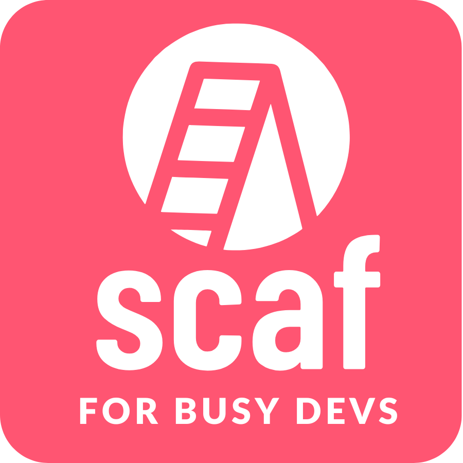

<p align="center">
  
</p>

**scaf fullstack template** provides developers and DevOps engineers with a
complete blueprint for a new project and streamlines the development experience
with Tilt.

**scaf fullstack template** generates a new project structure with Kubernetes
manifests in three Kustomize layers for dev, sandbox, and production. A new
project contains the following:

- Django backend
- Celery (optional)
- Next.js frontend (optional)
  - Strawberry GraphQL (if frontend is chosen)
  - Apollo Client (if frontend is chosen)
  - _TODO: REST alternative to GraphQL_
- Postgres database for local development
- CloudNativePG deployment for production
- Redis
- Mailhog
- ArgoCD
- Traefik
- Certmanger
- Certificates and Ingress Routes
- Kube Prometheus Stack
- Grafana Loki
- GitHub pipelines to build and push images, run security, formatting and
  linting checks
- Terraform config to set up a k3s or Talos cluster on AWS
- Sentry (optional)

## Installation

To create a new project using this template, you first need to install `scaf`:

```
curl -sSL https://raw.githubusercontent.com/sixfeetup/scaf/main/install.sh | bash
```

The installation script will install kubectl, kind, and Tilt if it can't
be found on your system.

## Creating a new project using this template

NB: Before you continue, make sure that you have at least 5 to 10 GB of free
space available to Docker. Note that Docker Desktop on MacOS has its own
resource limits separate from the host.

Run `scaf myproject https://github.com/sixfeetup/scaf-fullstack-template.git`,
answer all the questions, and you'll have your new project!

Inside `myproject/README.md`, you will have more documentation explaining how to
use and configure your newly created project.
