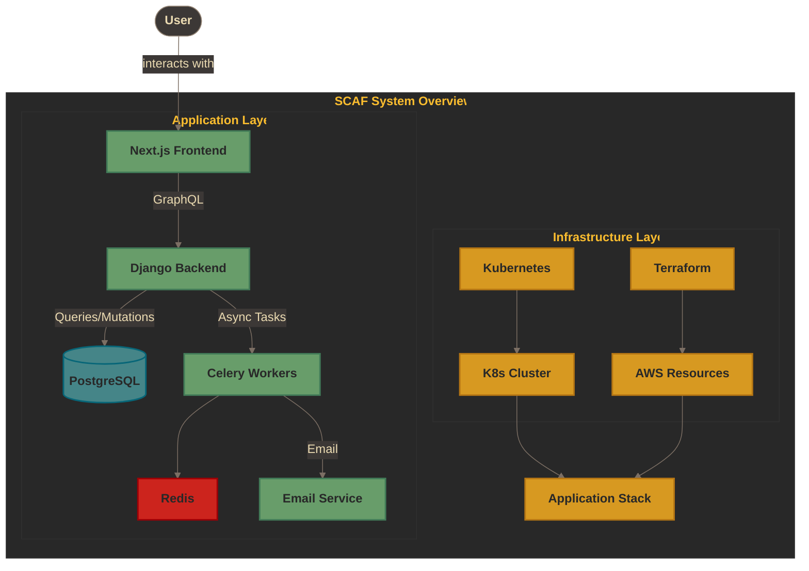
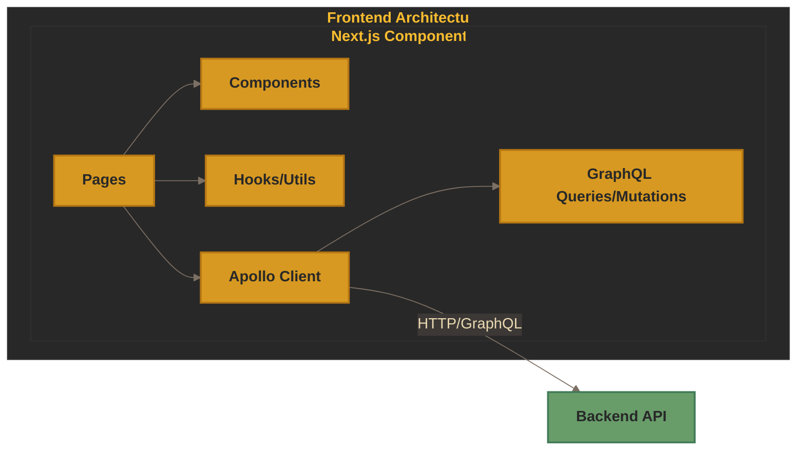
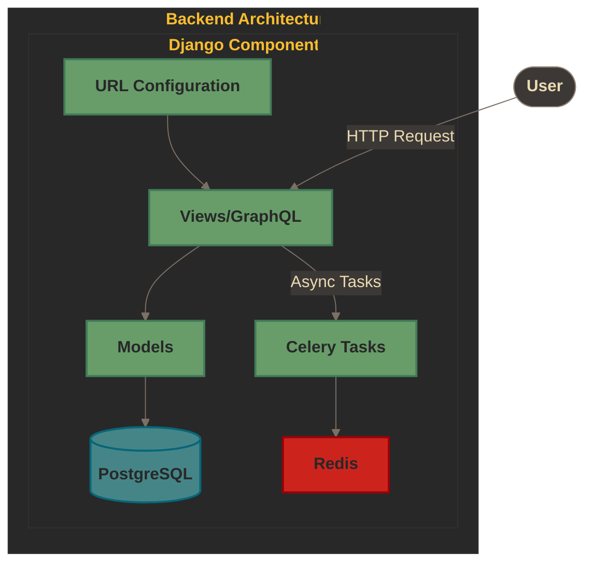
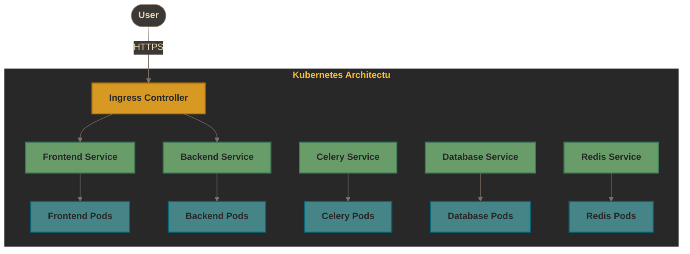
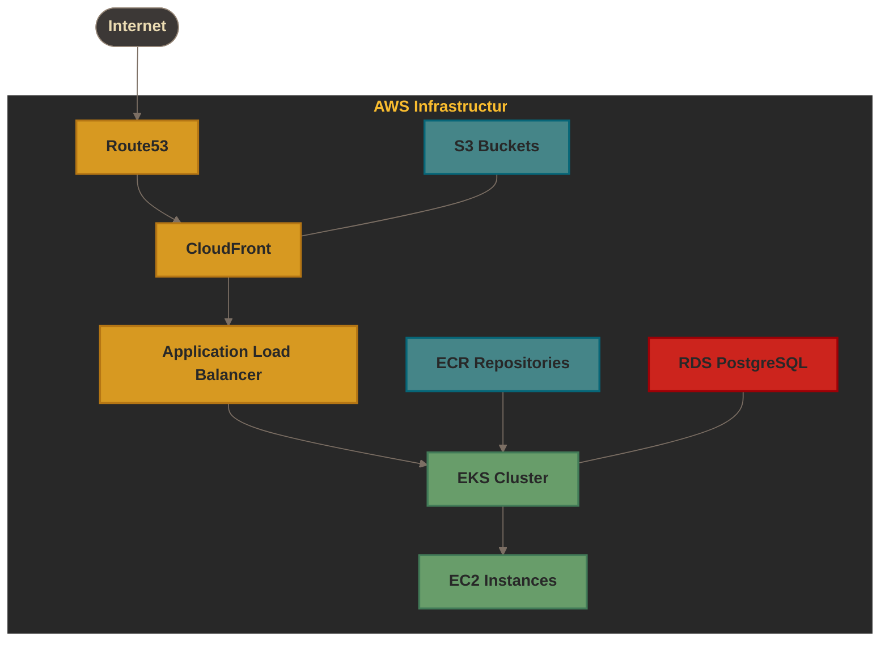
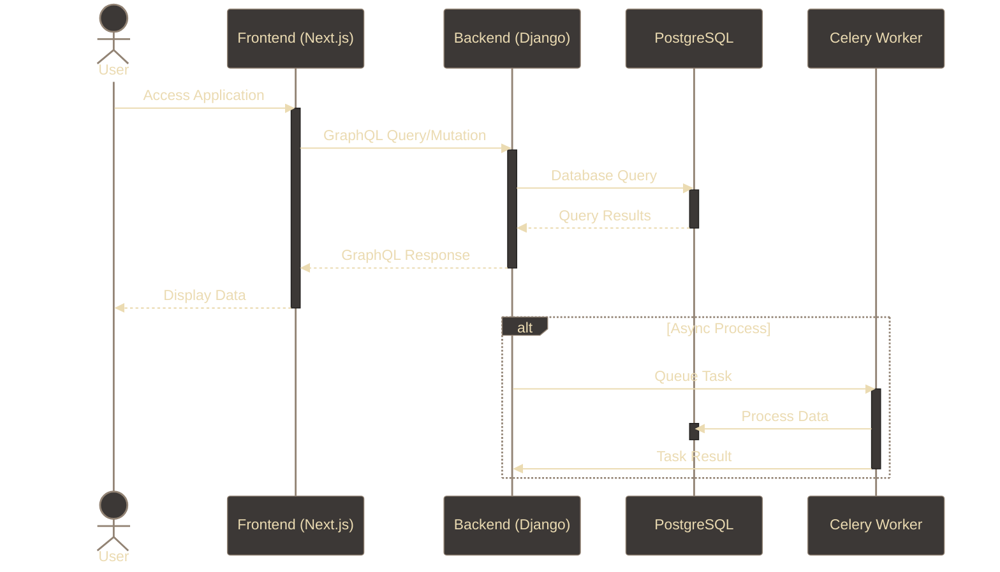
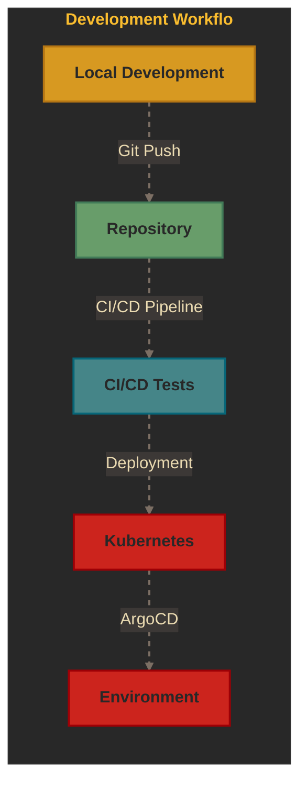
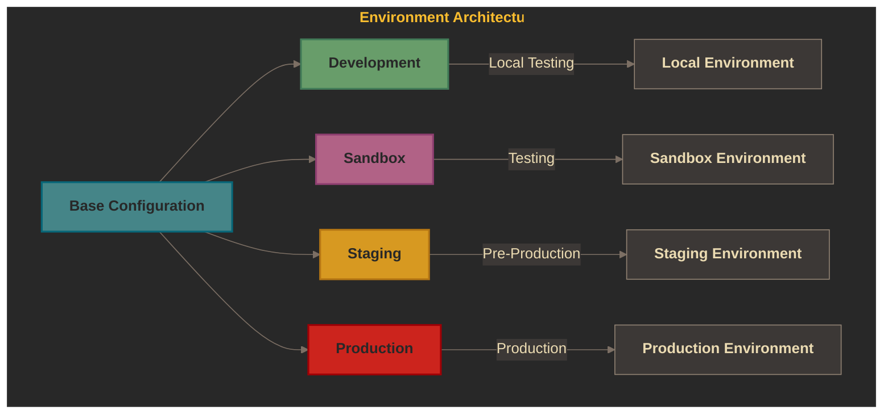

# :house: Architecture

This document outlines the architecture of the application, with diagrams to visualize the different components and their relationships.

## System Overview

The template provides a full-stack application with the following components:

## Application Architecture

### Frontend (Next.js)

The frontend is built with Next.js and TypeScript, using Apollo Client for GraphQL communication with the backend.

### Backend (Django)

The backend is built with Django, using Django GraphQL and Celery for async task processing.

## Infrastructure Architecture

### Kubernetes Deployment

The application is deployed on Kubernetes, with separate environments for development, staging, and production.

### AWS Infrastructure (Terraform)

The cloud infrastructure is managed with Terraform, provisioning AWS resources.

## Data Flow

This diagram illustrates how data flows through the system:

## Development Workflow

## Environment Architecture

The project supports multiple environments with different configurations:

