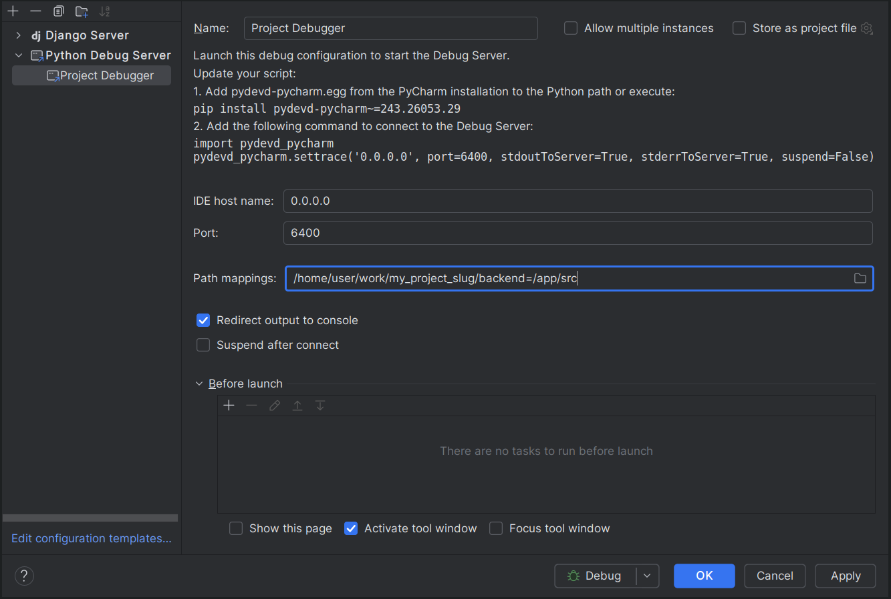

# :bug: How to debug the application

The steps below describe how to set up interactive debugging. Scaf supports

* PyCharm
* VS Code

## Starting Tilt with Debugging Support

To enable debugging, start Tilt with the `--debugpy` flag:

```bash
tilt up -- --debugpy
```

This will:
* Add the debug port (5678) to the backend service
* Modify the Django container to use debugpy
* Enable port forwarding for the debug port

Without the `--debugpy` flag, Tilt will run normally without debugging support.

## PyCharm Debugging

### Setup

Update `k8s/base/app.configmap.yaml` with:
* `data` field `PYTHONBREAKPOINT: "utils.pycharm_debugger"`
* `data` field `DEBUGGER_PORT: "6400"`

In PyCharm:

1. Go to 'Run' in the toolbar
2. Click on 'Edit Configurations'
3. Click on '+' in the top left of the dialog
4. Select 'Python Debug Server'
5. Set the host to 0.0.0.0 and the port to 6400, and the name as you see fit.
6. For 'path mappings' set /path/to/{{ copier__project_slug}}/backend=/app/src
7. Check 'Redirect console output to console'
8. Remove check on 'Suspend after connect'.
9. Click 'Ok'



### Debugging in development
Before the code you want to debug, add the following:

```python
breakpoint()
```

You must then set break points in PyCharm, and call the code as usual to hit them.

## VS Code Debugging

### Setup

Make sure you have started Tilt with the `--debugpy` flag as described above.

In VS Code:

1. Go to 'Run & Debug` tab
2. Click on 'create a launch.json file'
3. Choose 'Python Debugger'
4. Choose 'Remote Attach'
5. Set the host to `0.0.0.0`
6. Set the port to `5678`
7. VS Code will create a `.vscode/launch.json` with your configuration.
8. You'll need to update the `pathMappings` slightly. See the example below.
9. Make any desired further changes, then save. The file should something look like:

```json
{
    // Use IntelliSense to learn about possible attributes.
    // Hover to view descriptions of existing attributes.
    // For more information, visit: https://go.microsoft.com/fwlink/?linkid=830387
    "version": "0.2.0",
    "configurations": [
        {
            "name": "Python Debugger: Remote Attach",
            "type": "debugpy",
            "request": "attach",
            "connect": {
                "host": "0.0.0.0",
                "port": 5678
            },
            "pathMappings": [
                {
                    "localRoot": "${workspaceFolder}/backend",
                    "remoteRoot": "/app/src"
                }
            ]
        }
    ]
}
```

### Debugging in development

You can set break points in VS Code as normal, and call the code as usual to hit them.
