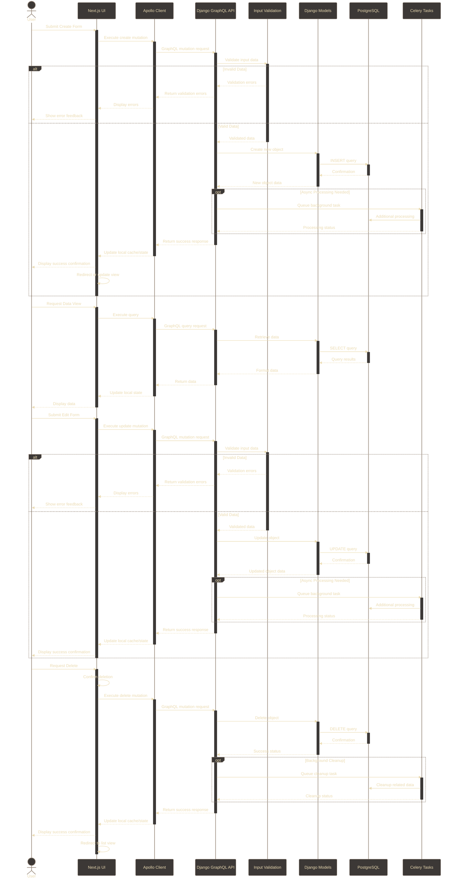
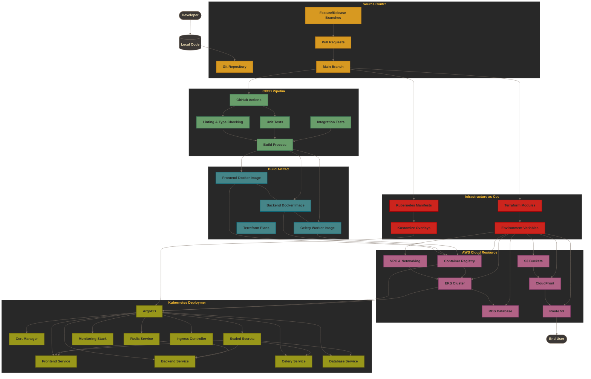

# :arrows_counterclockwise: Data Flow Diagrams

This document provides detailed data flow diagrams for the application, visualizing how data moves through different components and stages of the system.

## Comprehensive Data Flow

This diagram shows the overall data flow across all components of the system, including frontend, backend, storage systems, and external integrations.

```mermaid
%%{
  init: {
    'theme': 'base',
    'themeVariables': {
      'primaryColor': '#282828',
      'primaryTextColor': '#ebdbb2',
      'primaryBorderColor': '#7c6f64',
      'lineColor': '#7c6f64',
      'secondaryColor': '#3c3836',
      'tertiaryColor': '#504945'
    }
  }
}%%
flowchart TD
    %% External entities
    User([End User])
    Developer([Developer])
    
    %% Data sources
    subgraph DataSources["Data Sources"]
        direction TB
        FormInput[("User Form Input")]
        APIData[("External API Data")]
        FileUploads[("File Uploads")]
        StoredData[("Database Records")]
    end
    
    %% Frontend data flow
    subgraph FrontendFlow["Frontend Data Flow"]
        direction TB
        NextPages["Next.js Pages"]
        Components["React Components"]
        ClientState["Client State Management"]
        ApolloClient["Apollo Client"]
        GQLQueries["GraphQL Queries"]
        GQLMutations["GraphQL Mutations"]
        
        NextPages --> Components
        Components --> ClientState
        ClientState --> Components
        Components --> ApolloClient
        ApolloClient --> GQLQueries
        ApolloClient --> GQLMutations
    end
    
    %% Backend data flow
    subgraph BackendFlow["Backend Data Flow"]
        direction TB
        DjangoViews["Django Views/GraphQL"]
        QueryResolvers["GraphQL Query Resolvers"]
        MutationResolvers["GraphQL Mutation Resolvers"]
        DjangoModels["Django Models"]
        ModelValidation["Model Validation"]
        Serialization["Data Serialization"]
        CeleryTasks["Async Celery Tasks"]
        
        DjangoViews --> QueryResolvers
        DjangoViews --> MutationResolvers
        QueryResolvers --> DjangoModels
        MutationResolvers --> ModelValidation
        ModelValidation --> DjangoModels
        DjangoModels --> Serialization
        MutationResolvers --> CeleryTasks
        CeleryTasks --> DjangoModels
    end
    
    %% Storage systems
    subgraph StorageSystems["Storage Systems"]
        direction TB
        PostgreSQL[(PostgreSQL)]
        Redis[(Redis)]
        S3Bucket[(S3 Bucket)]
        
        PostgreSQL --> StoredData
    end
    
    %% External systems
    subgraph ExternalSystems["External Systems"]
        direction TB
        EmailService["Email Service"]
        ExternalAPIs["Third-Party APIs"]
    end
    
    %% Deployment data flow
    subgraph DeploymentFlow["Deployment Data Flow"]
        direction TB
        SourceCode[("Source Code")]
        GitRepo["Git Repository"]
        CISystem["CI/CD Pipeline"]
        DockerImages["Docker Images"]
        ECRRepository["ECR Repository"]
        K8sManifests["Kubernetes Manifests"]
        ArgoCD["ArgoCD"]
        K8sCluster["Kubernetes Cluster"]
        
        SourceCode --> GitRepo
        GitRepo --> CISystem
        CISystem --> DockerImages
        DockerImages --> ECRRepository
        K8sManifests --> ArgoCD
        ECRRepository --> ArgoCD
        ArgoCD --> K8sCluster
    end
    
    %% Primary data flow connections
    %% User/Client interactions
    User --> FormInput
    User --> FileUploads
    FormInput --> Components
    FileUploads --> Components
    
    %% Frontend to backend
    GQLQueries --> DjangoViews
    GQLMutations --> DjangoViews
    
    %% Backend to storage
    DjangoModels --> PostgreSQL
    CeleryTasks --> Redis
    CeleryTasks --> S3Bucket
    
    %% External integrations
    CeleryTasks --> EmailService
    QueryResolvers --> ExternalAPIs
    ExternalAPIs --> APIData
    APIData --> QueryResolvers
    
    %% Deployment workflow
    Developer --> SourceCode
    
    %% Response flows
    PostgreSQL --> DjangoModels
    Serialization --> QueryResolvers
    Serialization --> MutationResolvers
    QueryResolvers --> DjangoViews
    MutationResolvers --> DjangoViews
    DjangoViews --> GQLQueries
    DjangoViews --> GQLMutations
    GQLQueries --> ApolloClient
    GQLMutations --> ApolloClient
    ApolloClient --> Components
    Components --> NextPages
    NextPages --> User
    
    %% Style definitions - Gruvbox Dark theme
    classDef external fill:#3c3836,stroke:#928374,stroke-width:1px,color:#ebdbb2,font-weight:bold
    classDef frontend fill:#d79921,stroke:#b57614,stroke-width:2px,color:#282828,font-weight:bold
    classDef backend fill:#689d6a,stroke:#427b58,stroke-width:2px,color:#282828,font-weight:bold
    classDef storage fill:#458588,stroke:#076678,stroke-width:2px,color:#282828,font-weight:bold,shape:cylinder
    classDef queue fill:#cc241d,stroke:#9d0006,stroke-width:2px,color:#282828,font-weight:bold
    classDef data fill:#b16286,stroke:#8f3f71,stroke-width:2px,color:#282828,font-weight:bold
    classDef deployment fill:#98971a,stroke:#79740e,stroke-width:2px,color:#282828,font-weight:bold
    classDef external_system fill:#d65d0e,stroke:#af3a03,stroke-width:2px,color:#282828,font-weight:bold
    
    %% Apply styles
    class User,Developer external
    class NextPages,Components,ClientState,ApolloClient,GQLQueries,GQLMutations frontend
    class DjangoViews,QueryResolvers,MutationResolvers,DjangoModels,ModelValidation,Serialization,CeleryTasks backend
    class PostgreSQL,Redis,S3Bucket storage
    class FormInput,APIData,FileUploads,StoredData data
    class EmailService,ExternalAPIs external_system
    class SourceCode,GitRepo,CISystem,DockerImages,ECRRepository,K8sManifests,ArgoCD,K8sCluster deployment
    
    %% Explicit styling for subgraph titles
    style DataSources fill:#282828,color:#fabd2f,font-weight:bold
    style FrontendFlow fill:#282828,color:#fabd2f,font-weight:bold
    style BackendFlow fill:#282828,color:#fabd2f,font-weight:bold
    style StorageSystems fill:#282828,color:#fabd2f,font-weight:bold
    style ExternalSystems fill:#282828,color:#fabd2f,font-weight:bold
    style DeploymentFlow fill:#282828,color:#fabd2f,font-weight:bold
```

## CRUD Operations Flow

This sequence diagram illustrates the detailed flow of Create, Read, Update, and Delete operations from user interaction through the entire stack.

## API/Backend Data Processing Flow

This diagram illustrates how data moves through the various layers of the backend, from API requests to database operations.

```mermaid
%%{
  init: {
    'theme': 'base',
    'themeVariables': {
      'primaryColor': '#282828',
      'primaryTextColor': '#ebdbb2',
      'primaryBorderColor': '#7c6f64',
      'lineColor': '#7c6f64',
      'secondaryColor': '#3c3836',
      'tertiaryColor': '#504945'
    }
  }
}%%
flowchart TD
    %% Request entry points
    GraphQLReq(["GraphQL Request"])
    RestReq(["REST API Request"])
    CeleryTask(["Scheduled/Triggered Task"])
    
    %% Authentication & permission layer
    subgraph AuthLayer["Authentication & Authorization"]
        direction LR
        TokenAuth["Token Authentication"]
        SessionAuth["Session Authentication"]
        Permissions["Permission Checks"]
        
        TokenAuth --> Permissions
        SessionAuth --> Permissions
    end
    
    %% Request processing layer
    subgraph APILayer["API Processing Layer"]
        direction LR
        GQLSchema["GraphQL Schema"]
        GQLResolvers["GraphQL Resolvers"]
        RestViews["REST API Views"]
        Serializers["Django Serializers"]
        
        GQLSchema --> GQLResolvers
        RestViews --> Serializers
    end
    
    %% Business logic layer
    subgraph BusinessLayer["Business Logic Layer"]
        direction TB
        Services["Service Functions"]
        ModelMethods["Model Methods"]
        HelperFuncs["Helper Utilities"]
        Validators["Data Validators"]
        
        Services --> ModelMethods
        Services --> HelperFuncs
        Services --> Validators
    end
    
    %% Data access layer
    subgraph DataLayer["Data Access Layer"]
        direction TB
        Models["Django Models"]
        Managers["Custom Managers"]
        QuerySets["QuerySet Methods"]
        RawSQL["Raw SQL (when needed)"]
        
        Models --> Managers
        Managers --> QuerySets
        Managers --> RawSQL
    end
    
    %% Database layer
    subgraph DBLayer["Database Layer"]
        direction LR
        ReadReplica[("Read Replica")]
        MainDB[("Primary Database")]
        Migrations["Django Migrations"]
        
        ReadReplica --- MainDB
        Migrations --> MainDB
    end
    
    %% Asynchronous processing
    subgraph AsyncLayer["Asynchronous Processing"]
        direction TB
        CeleryQueue["Celery Task Queue"]
        Workers["Celery Workers"]
        Results["Task Results Storage"]
        
        CeleryQueue --> Workers
        Workers --> Results
    end
    
    %% External services integration
    subgraph ExternalLayer["External Integrations"]
        direction LR
        Email["Email Service"]
        Storage["S3 Storage"]
        ThirdParty["3rd Party APIs"]
        
        Email --- Storage
        Storage --- ThirdParty
    end
    
    %% Main request flow
    GraphQLReq --> TokenAuth
    RestReq --> SessionAuth
    Permissions --> GQLSchema
    Permissions --> RestViews
    GQLResolvers --> Services
    Serializers --> Services
    Services --> Models
    Models --> MainDB
    Models --> ReadReplica
    
    %% Async flow
    GQLResolvers --> CeleryQueue
    RestViews --> CeleryQueue
    CeleryTask --> CeleryQueue
    Workers --> Services
    Workers --> ExternalLayer
    
    %% Return flow
    MainDB --> Models
    ReadReplica --> Models
    Models --> Services
    Models --> ModelMethods
    Services --> GQLResolvers
    Services --> Serializers
    GQLResolvers --> |Response| GraphQLReq
    Serializers --> |Response| RestReq
    
    %% Style definitions - Gruvbox Dark theme
    classDef input fill:#3c3836,stroke:#928374,stroke-width:1px,color:#ebdbb2,font-weight:bold
    classDef auth fill:#d79921,stroke:#b57614,stroke-width:2px,color:#282828,font-weight:bold
    classDef api fill:#689d6a,stroke:#427b58,stroke-width:2px,color:#282828,font-weight:bold
    classDef business fill:#458588,stroke:#076678,stroke-width:2px,color:#282828,font-weight:bold
    classDef data fill:#cc241d,stroke:#9d0006,stroke-width:2px,color:#282828,font-weight:bold
    classDef db fill:#b16286,stroke:#8f3f71,stroke-width:2px,color:#282828,font-weight:bold
    classDef async fill:#98971a,stroke:#79740e,stroke-width:2px,color:#282828,font-weight:bold
    classDef ext fill:#d65d0e,stroke:#af3a03,stroke-width:2px,color:#282828,font-weight:bold
    
    %% Apply styles
    class GraphQLReq,RestReq,CeleryTask input
    class TokenAuth,SessionAuth,Permissions auth
    class GQLSchema,GQLResolvers,RestViews,Serializers api
    class Services,ModelMethods,HelperFuncs,Validators business
    class Models,Managers,QuerySets,RawSQL data
    class ReadReplica,MainDB,Migrations db
    class CeleryQueue,Workers,Results async
    class Email,Storage,ThirdParty ext
    
    %% Explicit styling for subgraph titles
    style AuthLayer fill:#282828,color:#fabd2f,font-weight:bold
    style APILayer fill:#282828,color:#fabd2f,font-weight:bold
    style BusinessLayer fill:#282828,color:#fabd2f,font-weight:bold
    style DataLayer fill:#282828,color:#fabd2f,font-weight:bold
    style DBLayer fill:#282828,color:#fabd2f,font-weight:bold
    style AsyncLayer fill:#282828,color:#fabd2f,font-weight:bold
    style ExternalLayer fill:#282828,color:#fabd2f,font-weight:bold
```

## Deployment/Infrastructure Data Flow

This diagram visualizes how code and configuration flow through the CI/CD pipeline to cloud and Kubernetes infrastructure.

