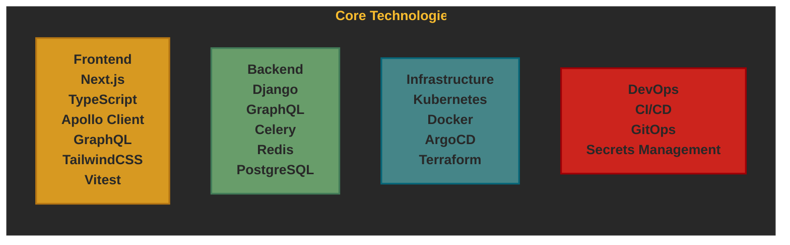

# :telescope: Project Overview

This project template provides a full-stack application scaffold with integrated deployment tooling. It's designed to quickly bootstrap new projects with a standardized architecture and best practices.

## Purpose

The purpose of this template is to:

1. Provide a consistent starting point for new projects
2. Implement best practices for development, testing, and deployment
3. Reduce setup time for new projects
4. Ensure infrastructure is defined as code from the beginning
5. Enable rapid iteration and deployment to various environments

## Core Technologies

## Design Principles

The template follows these design principles:

1. **Infrastructure as Code**: All infrastructure is defined in Terraform and Kubernetes manifests
2. **GitOps**: Deployment is managed through Git using ArgoCD
3. **Environment Parity**: Development, sandbox, staging, and production environments use the same configuration base
4. **Containerization**: All application components run in containers
5. **Microservices**: The application is structured as separate services (frontend, backend, workers)
6. **API-First**: Backend exposes GraphQL API consumed by the frontend
7. **Async Processing**: Long-running tasks are handled asynchronously with Celery

## How to Use This Template

1. Create a new project using Copier with this template
2. Fill in the required variables during setup
3. Initialize the Git repository
4. Start development with the included tooling

For more details on the architecture, see the [Architecture Documentation](./architecture.md).

## Key Features

- Next.js frontend with TypeScript and GraphQL integration
- Django backend with GraphQL API
- Celery for background task processing
- Kubernetes manifests for deployment
- Terraform for infrastructure provisioning
- CI/CD pipeline configuration
- Comprehensive documentation
- Development environment setup
- Testing infrastructure